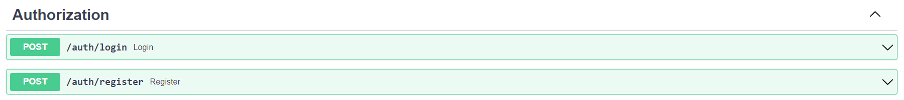
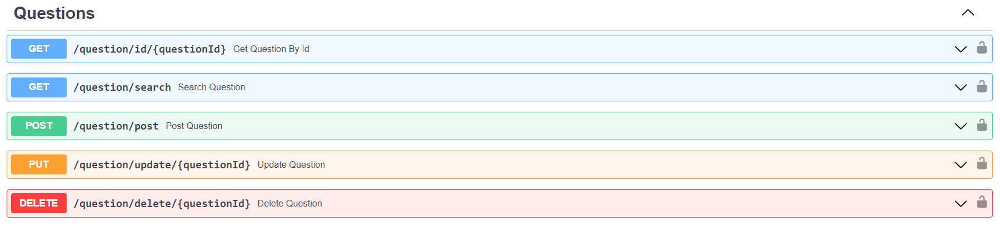
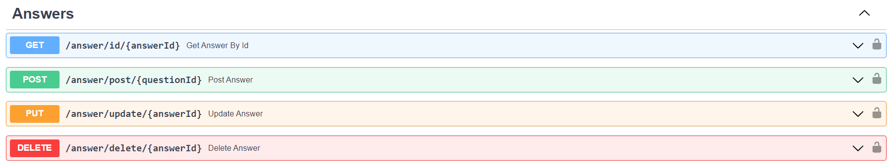
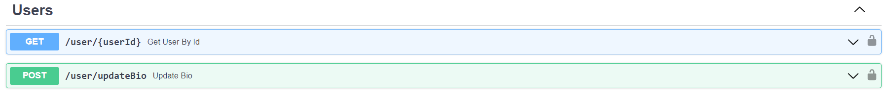

# Quora-API-Clone
A basic quora API built using fastapi and alembic

# Routes

# How to run this project in your local environment

>Note : python3 and postgresql must be installed

- Clone the repo to your local environment
- Create a python virtual environment `python -m venv venv`
- Activate the virtual environment `venv/Scripts/activate`
- Run `pip install -r requirements.txt`
- Create a database named **quora-api** in postgres
- Create a **.env** file in the root directory
- Add the following fields in the **.env** file
    - DATABASE_HOSTNAME=
    - DATABASE_PORT=
    - DATABASE_PASSWORD=
    - DATABASE_NAME=quora-api
    - DATABASE_USERNAME=
    - SECRET_KEY=54CCACBC21919115E5EF9C49D8AEF
    - ALGORITHM=HS256
    - ACCESS_TOKEN_EXPIRE_MINUTES=30
- Run `uvicorn app.main:app` to start the server
- The command above outputs a line like this *Uvicorn running on http://127.0.0.1:8000*
- Open the url in your browser and go to *http://127.0.0.1:8000/docs* to view all the API routes with documentation
